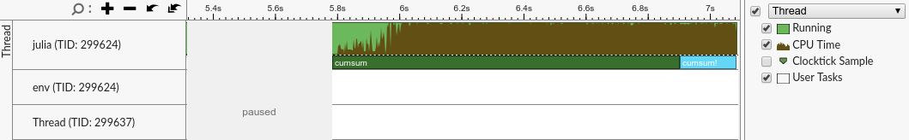
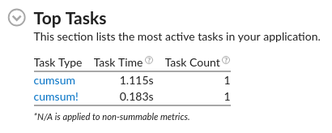
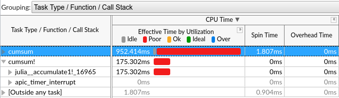
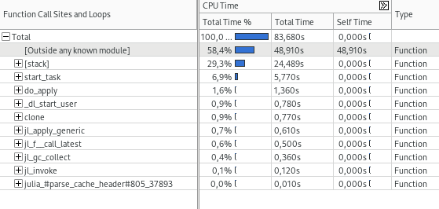
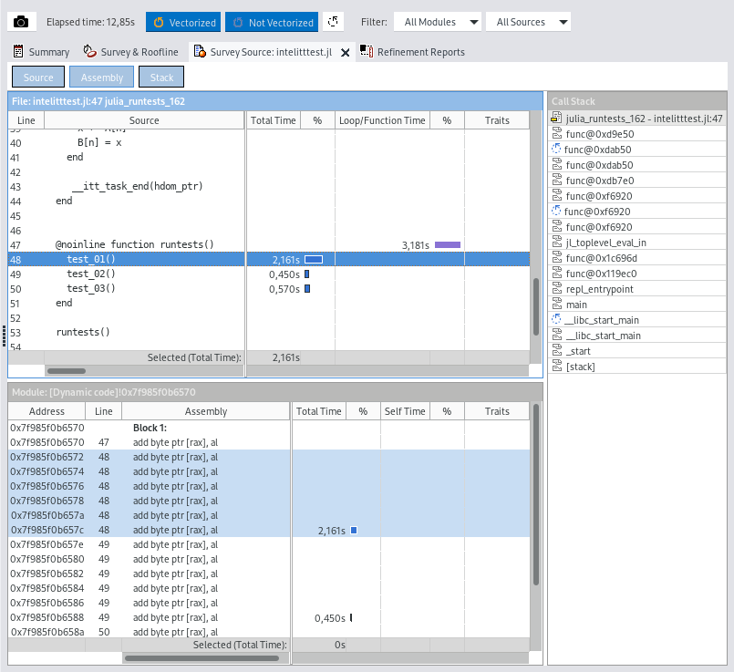
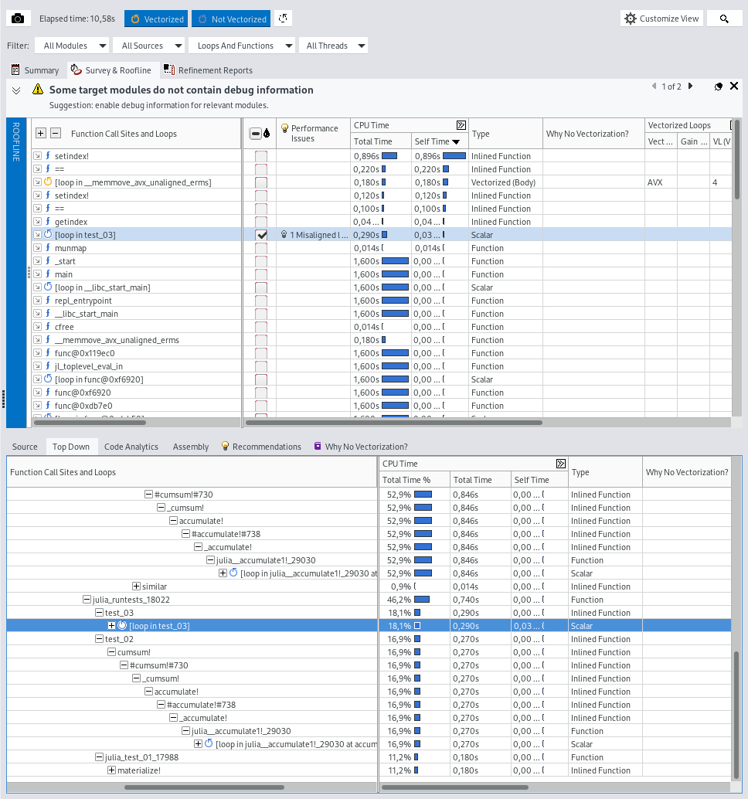
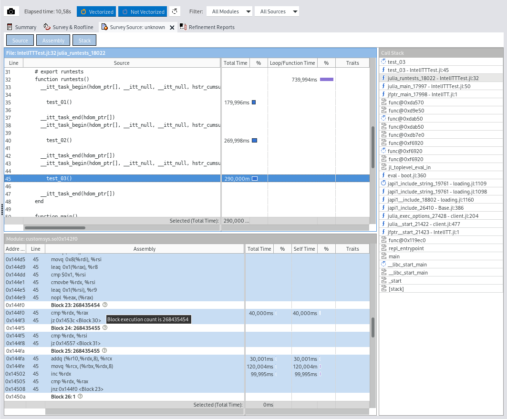
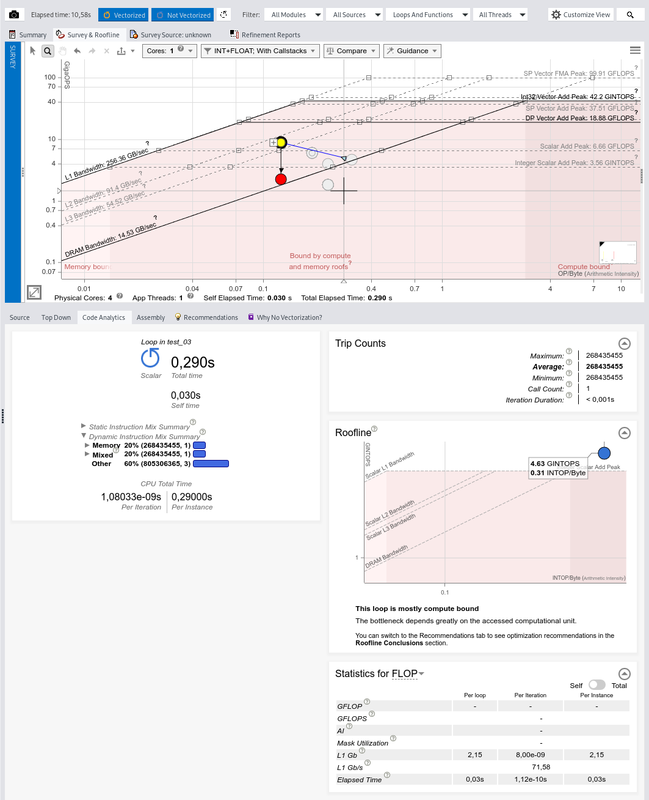

**UPDATE** 2022 Nov 24: this repository was archived in favor of [JuliaPerf/IntelITT.jl](https://github.com/JuliaPerf/IntelITT.jl)

---

(WARNING: proof of concept! Times this was tested: 1½)

A wrapper for the [Intel Instrumentation and Tracing Technology APIs](https://software.intel.com/en-us/vtune-help-instrumentation-and-tracing-technology-apis)

## What works

see [IntelITTTest.jl](examples/IntelITTTest/src/IntelITTTest.jl) file

start and stop Intel VTune/Advisor from within julia



configure "user tasks" from within julia




## Installation requirements (Linux)

This currently works with a shared object `libittnotify.so` ...  but the _other_ `libittnotify.so` that is NOT distributed with Intel vtune amplifier/profiler.
Intel vtune amplifier/profiler comes with a `libittnotify.a` instead.

_(NOTE: there are `lib64/runtime/libittnotify.so` and `sdk/lib64/libittnotify.so` but it is `libittnotify.a` which is [meant to be used](https://software.intel.com/content/www/us/en/develop/documentation/vtune-help/top/api-support/instrumentation-and-tracing-technology-apis/basic-usage-and-configuration/configuring-your-build-system.html))_

This file is usually found in the `lib64` folder of your Intel vtune amplifier/profiler installation, e.g.

```
/opt/intel/some_intel_vtune_product/lib64/libittnotify.a
```

I've created a shared object by extracting the `libittnotify.a`

```bash
ar x libittnotify.a
```

and linking it into a shared object

```bash
gcc -shared ittnotify_static.o ittptmark64.o -o libittnotify.so
```

You might need to adapt the `LIBITTNOTIFY_PATH` constant in [IntelITT.jl](src/IntelITT.jl) or place a symlink.

## Compile Julia from source with JITEVENTS enabled

The issue:



_(NOTE: you might not recompile julia, but "just" create a shared object / custom sysimage instead: see next section)_

In Order for Intel's Profiler to obtain information about dynamically generated code (JIT), julia can (via LLVM) emit "JIT-events" that seem to serve this purpose.

There is [some discussion on discourse](https://discourse.julialang.org/t/using-the-intel-vtune-profiler-with-julia/34327) about this, but [on Archlinux](https://github.com/archlinux/svntogit-community/blob/7d96a4758ecd4ff1ff9a286d8f2f6feafcdf2065/trunk/PKGBUILD#L75) I had to _somehow_ pass the following build options to `make`

```bash
# do not use the system distributed LLVM but our own
USE_SYSTEM_LLVM=0
# do not build LLVM, but download it
USE_BINARYBUILDER_LLVM=1
# enable JIT-everything!
USE_INTEL_JITEVENTS=1
USE_PROFILE_JITEVENTS=1
USE_PERF_JITEVENTS=1
```

Due to a [current bug](https://discourse.julialang.org/t/compiling-fails-with-use-intel-jitevents-use-oprofile-jitevents-and-use-perf-jitevents-1/51274) that [should be already fixed](https://github.com/JuliaLang/julia/pull/38741), I had to apply [a tiny patch](jitprofiling.patch) to Julia's sources for enabling all three kinds of JITEVENTS.

For getting more symbols resolved in the Intel tools lateron, it might be helpful to disable "stripping" of the compiled binaries (`options=(!strip debug)` in Archlinux's PKGBUILD file) if that applies.

Finally, julia needs to be started with the environment variable `ENABLE_JITPROFILING=1` set.

## Creating a shared object (custom sysimage)

The issue:



While the JIT-events enable to see functions, somehow loops and assembly code are not detected within Intel Advisor.
That might be intentional. A way around this is to create a shared object with the compiled functions.

I got this only working by [creating a separate Module](examples/IntelITTTest/src/IntelITTTest.jl) which contains the code to-be-tested.
The whole process takes a while and it might be possible to do this _incrementally_ somehow ... but this will save a lot of time during tracing lateron!

```bash
cd examples
julia --startup-file=no --trace-compile=trace.jl intelitttest.jl
julia --startup-file=no --output-o customsys.o -J"/usr/lib/julia/sys.so" custom_sysimage.jl
gcc -shared -o customsys.so \
  -Wl,--whole-archive customsys.o -Wl,--no-whole-archive -L"/usr/lib/julia/" -ljulia
julia -Jcustomsys.so
```

## Intel Advisor 2021.3

```julia
# a cumsum! implementation (on global variables A and B)
function test_03()
  x = B[1] = A[1]
  for n in 2:length(A)
    x += A[n]
    B[n] = x
  end
end
```





You may find a package four your particular Linux distribution or [download Advisor from Intel directly](https://software.intel.com/content/www/us/en/develop/articles/oneapi-standalone-components.html#advisor).

On Archlinux, I had to work-around the installer because of a failing dependency check by [manually extracting all .cup files](https://community.intel.com/t5/Analyzers/disable-PreRequisite-install-check-nss-check-failed-libnss3-so/m-p/1303524/emcs_t/S2h8ZW1haWx8dG9waWNfc3Vic2NyaXB0aW9ufEtSWDJQMFM0QVI4MTVCfDEzMDM1MjR8U1VCU0NSSVBUSU9OU3xoSw#M21077) that come with this particular version.

To start the advisor gui, one needs to source a script which then makes `advisor-gui` available as a command

```bash
. advisor/2021.3.0/env/vars.sh
advisor-gui
```

For the tracing, Advisor will complain when `ptrace_scope` is not 0 which I had to set on my system:

```bash
echo 0 | sudo tee /proc/sys/kernel/yama/ptrace_scope
```

Advisor will run a program multiple times with different settings to trace different aspects.
The collection can be done without the graphical frontend with the `advisor` command

```bash
advisor --help collect | less
```

The command line arguments are also generated by the graphical frontend `advisor-gui` for the purpose of copy-n-pasting them, but for comparison here are my commands:

_(NOTE: the `-Jcustomsys.so` parameter only applies when a shared object / custom sysimage was created)_

```bash
# this might not be necessary, when set up correctly in the project file
export ENABLE_JITPROFILING=1
# run Intel Advisor (without graphical frontend)
advisor                                                            \
  `# type of tracing`                                              \
  -collect survey                                                  \
  `# this enables us to skip tracing julia's startup`              \
  `#   collection starts when __itt_resume is called`              \
  -start-paused                                                    \
  `# the directory where our results will be placed`               \
  `#   It might be, that the to-be-set environment variables are`  \
  `#   taken from some project file (like ENABLE_JITPROFILING)`    \
  `#   but one can also set them up before launching advisor`      \
  -project-dir /home/christianl/intel/advixe/projects/intelitttest \
  `# this seems to be used for source code navigation in the gui`  \
  --search-dir src:p=/usr/share/julia/base                         \
  --search-dir src:p=/home/christianl/IntelITT.jl/examples         \
  `# working directory`                                            \
  --app-working-dir=/home/christianl/IntelITT.jl/examples          \
  `# deliminator`                                                  \
  --                                                               \
  `# command to run`                                               \
  /usr/bin/julia -Jcustomsys.so intelitttest.jl
```

```bash
advisor                                                            \
  `# type of tracing`                                              \
  -collect tripcounts                                              \
  `# this is a "knob" in the graphical frontend`                   \
  -flop                                                            \
  `# this is also a "knob" in the graphical frontend`              \
  -stacks                                                          \
  `# these numbers "are" the loops that will be investigated`      \
  `#   the loop enumeration must not change beween runs`           \
  `#   i.e. they need to be "discovered" similarly by Advisor`     \
  `#     (however this works)`                                     \
  -mark-up-list=13,14                                              \
  `# the rest is same as before`                                   \
  -start-paused                                                    \
  -project-dir /home/christianl/intel/advixe/projects/intelitttest \
  --search-dir src:p=/usr/share/julia/base                         \
  --search-dir src:p=/home/christianl/julia/IntelITT.jl/examples   \
  --app-working-dir=/home/christianl/julia/IntelITT.jl/examples    \
  -- /usr/bin/julia -Jcustomsys.so intelitttest.jl                 \
```
